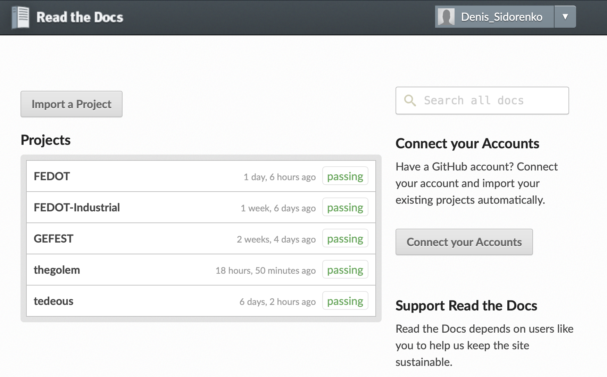
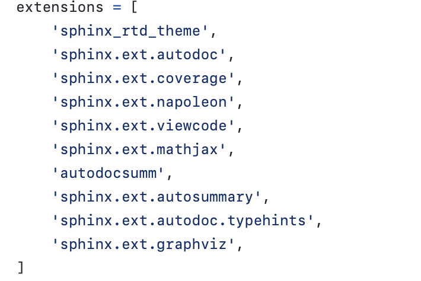
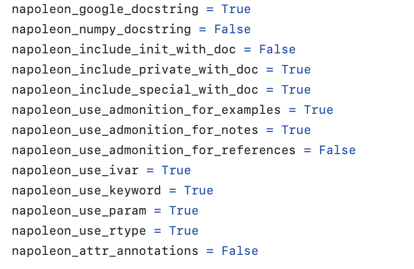
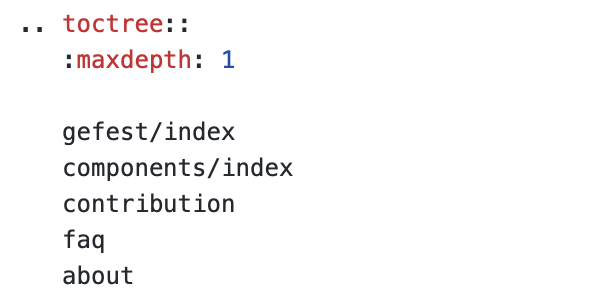
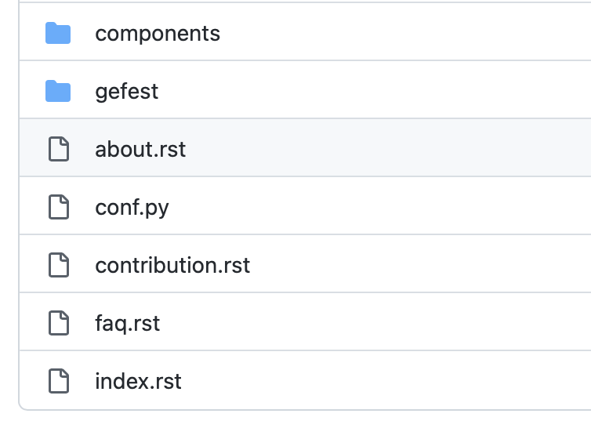
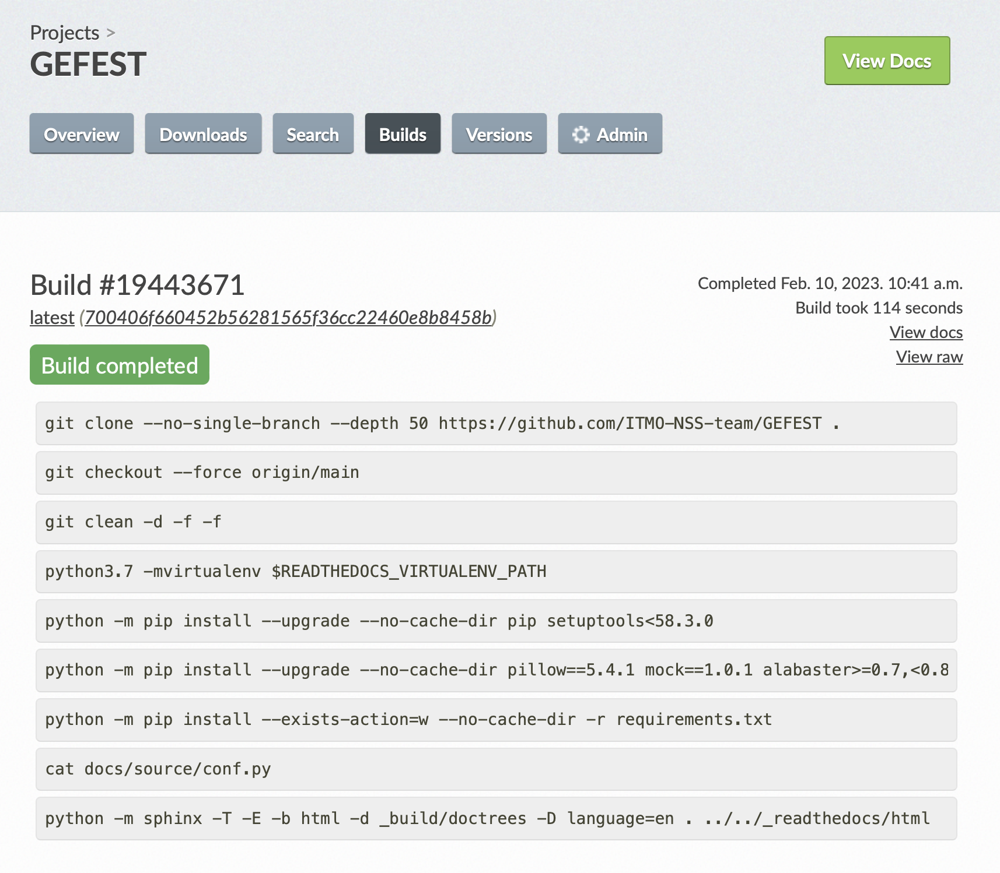

# Руководство по документированию проекта - Read The Docs

## 1. Создание профиля Read The Docs

Создать сайт с документацией по проекту можно с помощью сервиса [Read the Docs](https://readthedocs.org).
Для этого необходимо проделать несколько шагов, описанных ниже.

### 1.1 Создание профиля (аккаунта) проекта

После регистрации аккаунта на сайте **readthedocs.org** необходимо связать аккаунт с GitHub аккаунтом, владеющим проектом, который
необходимо документировать.
Эта процедура настраивается с помощью **"Import a Project -> Connect to GitHub -> Выбор репозитория из списка доступных"**

После интеграции проекта в среду Read The Docs вы увидите доступный для настройки проект

### 1.2 Настройки проекта

В разделе **"Admin -> Advanced Settings"** важно и нужно:

1. Назначить ветку проекта, из которой будет собираться основная (стабильная) версия документации.

2. Позволить сборку документации на основе Pull Request.

> Эта функция позволяет автоматически собирать документацию после каждого коммита в PR

3. Добавить контрибьютора в проект (если нужно).

> Контрибьютор должен зарегистрироваться на сайте **readthedocs.org**, добавить его к проекту можно, используя электронную почту.  
>
> Для добавления нового участника перейдите в **"Admin -> Maintainers"**

## 2. Создание структуры документации в репозитории

Для того, чтобы в системе Read The Docs собиралась документация из репозитория необходимо в самом репозитории
создать "структуру" собираемой документации. Глобально, вся структура документации и настройки её отображения содержатся в директории `docs`, а
корне репозитория располагается манифест `.readthedocs.yml`, позволяющий "активировать" сборку документации.
В качестве примера организации структуры можно заглянуть в [open-source проект](https://github.com/aimclub/GEFEST)

Создать начальную структуру документации внутри проекта можно **2 способами**:

>1. С помощью библиотеки sphinx:  
>
>>**Шаг 1**. [Установка библиотеки локально](https://www.sphinx-doc.org/en/master/usage/installation.html)  
>>
>>**Шаг 2**. [Создание структуры документации с помощью команды быстрой настройки](https://www.sphinx-doc.org/en/master/usage/quickstart.html)
>
>2. Импортировать готовые настройки из стороннего проекта:  
>
>>**Шаг 1**. В корень репозитория скопировать манифест [.readthedocs.yml](https://github.com/aimclub/GEFEST/blob/main/.readthedocs.yml) (можно копировать без внесения правок)  
>>
>>**Шаг 2**. В корень репозитория скопировать директорию [docs](https://github.com/aimclub/GEFEST/tree/main/docs)  
>>
>>**Шаг 3**. Внутри директории `docs` удалить `tutorials`, очистить от изображений директорию `img` (в дальнейшем в этой директории будут храниться все изображения вашей документации)  
>>
>>**Шаг 4**. Внутри директории `docs->source` оставить только файлы `index.rst`, `conf.py` (значение этих файлов и работа с ними описана ниже)

## 3. Настройка конфигураций проекта документации

Для корректной сборки документации проекта в большинстве случаев будет достаточно импортировать существующие
конфигурации по пути `docs -> source -> conf.py` из стороннего проекта, например [GEFEST](https://github.com/aimclub/GEFEST/blob/main/docs/source/conf.py),
и изменить первую часть конфиг файла, заменив имя проекта и автора. Однако целью данного руководства является внесение ясности в суть имеющихся настроек.

### 3.1 General configuration

В данном разделе в переменную `extensions` необходимо поместить список расширений, которые необходимы для корректной сборки документации

Описание некоторых из них:

> - `sphinx_rtd_theme` - устанавливает тему отображения документации (альтернатива - `alabaster`)
> - `sphinx.ext.autodoc` - позволяет формировать документацию из докстрингов
> - `sphinx.ext.napoleon` - добавляет в окружение проекта пакет *napoleon*, способный расширять функционал отображения документации
> - `sphinx.ext.viewcode` - возможность отображения блоков кода в документации
> - `sphinx.ext.mathjax` - возможность отображения математических формул
> - `sphinx.ext.graphviz` - дополнительный функционал для отображения графиков и другой визуализации

Каждый проект требует собственного набора расширений для той или иной задачи, основные можно найти [в документации по extensions](https://www.sphinx-doc.org/en/master/usage/extensions/index.html).

### 3.2 Options for HTML output

В данном разделе по умолчанию задается только переменная `html_theme`, однако, если в документацию необходимо добавить, например, изображения формата GIF,
нужно добавить дополнительные настройки

Больше информации о настройках можно найти [в документации Html Theming](https://www.sphinx-doc.org/en/master/usage/theming.html).

### 3.3 Extension configuration

В данном разделе указываются дополнительные параметры для расширений `extensions`, которые описаны в [3.1 General configuration](#31-general-configuration).

Параметры для **napoleon**:

Больше информации о настройках можно найти [в документации napoleon](https://sphinxcontrib-napoleon.readthedocs.io/en/latest/sphinxcontrib.napoleon.html).

## 4. Создание разделов документации в репозитории

По умолчанию (в соответствии со стандартными настройками `.readthedocs.yml`) структура документации строится в директории `docs -> source`
с помощью файла [index.rst](https://github.com/aimclub/GEFEST/blob/main/docs/source/index.rst).

Первое, с чего нужно начать наполнение документации - схема (скелет/иерархия) всей документации. Нужно определить, какие разделы будут присутствовать,
в каком порядке они будут расположены относительно друг друга. Вся эта информация нужна для создания начального файла индексации `index.rst`, расположенного в директории `source`.

Например, структура может выглядеть так:

В данном случае `index.rst` является лишь связующим звеном между файлами, содержащими контент. В сам файл записываются названия файлов с расширением `.rst`
или же пути в директории до других файлов (собственных для каждой отдельной директории) `index.rst`

На сайте документации в Read The Docs этот файл, помимо начальной страницы, которая выглядит [вот так](https://github.com/aimclub/GEFEST/blob/main/docs/source/index.rst), создаст еще и иерархию контента:

В качестве наглядного примера работы созданной структуры можно посмотреть на связку файлов:

[Начальный index.rst](https://github.com/aimclub/GEFEST/blob/main/docs/source/index.rst) содержал в себе запись
со ссылкой [на другой index.rst](https://github.com/aimclub/GEFEST/blob/main/docs/source/gefest/index.rst) файл в директории `docs -> source -> gefest -> index.rst`.
В свою очередь, последний файл содержал записи о том, что необходимо в данный раздел "подтянуть" контент из трех файлов:
[gefest.rst](https://github.com/aimclub/GEFEST/blob/main/docs/source/gefest/gefest.rst),
[installation.rst](https://github.com/aimclub/GEFEST/blob/main/docs/source/gefest/installation.rst),
[quickstart.rst](https://github.com/aimclub/GEFEST/blob/main/docs/source/gefest/quickstart.rst).

Таким образом, на сайте в [разделе документации GEFEST](https://gefest.readthedocs.io/en/latest/gefest/index.html) появилось три подраздела с контентом
[Intro to GEFEST](https://gefest.readthedocs.io/en/latest/gefest/gefest.html),[Installation from GitHub](https://gefest.readthedocs.io/en/latest/gefest/installation.html),
[Quickstart](https://gefest.readthedocs.io/en/latest/gefest/quickstart.html).

## Синтаксис ReStructuredText (.rst файлов)

Для того, чтобы информация отображалась корректно, необходимо придерживаться корректного синтаксиса.
Как шпаргалку можно использовать [руководство по reStructuredText](https://www.sphinx-doc.org/en/master/usage/restructuredtext/basics.html).

Во время создания таких файлов с контентом удобно использовать встроенные в IDE *preview*, для этого нужно установить
в среду разработки расширение. [Для VsCode](https://marketplace.visualstudio.com/items?itemName=lextudio.restructuredtext)
или [для PyCharm](https://www.jetbrains.com/help/pycharm/restructured-text.html).

## 5. Создание докстрингов

Докстринг - это описание метода/класса/функции и их параметров, обрамленное тройными кавычками.

Докстринги используются для автоматической генерации документации, а также в качестве превью методов/классов/функций для большего удобства
при взаимодействии с модулями проекта в процессе написания кода.

Подробнее о написании докстрингов и их возможностях можно прочитать [по ссылке](https://www.geeksforgeeks.org/python-docstrings/).

Существует несколько вариантов синтаксиса докстрингов.
В данном руководстве мы используем и рекомендуем для применения **Google-Style** как наиболее удобный в использовании и интуитивно понятный вариант.

По ссылке можно ознакомиться с правилами и конкретными примерами использования [Google-Style докстрингов](https://sphinxcontrib-napoleon.readthedocs.io/en/latest/example_google.html).

## Как "подтянуть" докстринги в документацию?

Оформление страниц документации на сайте Read The Docs, содержащей информацию о методах и классах из докстрингов осуществляется так же через
файлы с расширением `.rst`.  
[Пример оформления файла с использованием докстрингов](https://github.com/aimclub/GEFEST/blob/main/docs/source/components/geometry.rst).  
[Страница документации, построенная с помощью данного файла](https://gefest.readthedocs.io/en/latest/components/geometry.html).  
[Файл с кодом (контентом в докстрингах)](https://github.com/aimclub/GEFEST/blob/main/gefest/core/geometry/geometry_2d.py).

Из примера видно, что необходимо использовать команду `.. autoclass:: <path to class>`. Эта команда используется тогда, когда нужно задокументировать докстринги только
одного конкретного класса во всем файле `.py`. В случае, когда в документацию необходимо поместить все докстринги из файла с кодом, нужно использовать команду
`.. automodule:: <path to class>`.

Подробнее о том, какие настройки отображения можно применить к данным командам в [руководстве по autodoc](https://www.sphinx-doc.org/en/master/usage/extensions/autodoc.html).

## 6. Сборка документации

После того, как создана структура документации, необходимо запустить процесс ее сборки.

Сборку документации можно выполнить локально (чтобы отследить корректность сборки и исправить ошибки сразу)
с помощью пакета [Sphinx](https://www.sphinx-doc.org/en/master/usage/quickstart.html) и команды `make html`.

Однако отсутствие ошибок локально не гарантирует корректность сборки на сервере Read The Docs.
Например, могут различаться версии Python, в таком случае часть документации не соберется из-за несовместимости синтаксиса кода.

В тот момент, когда происходит отправка очередного коммита с документацией в Pull Request на GitHub, документация начинает собираться автоматически:

Для того, чтобы проверить корректность сборки, необходимо перейти в личный кабинет на сайте **readthedocs.org**, зайти в проект и
перейти в раздел **"Сборки/Builds"**

Последняя вкладка в данном разделе содержит лог сборки. Именно здесь можно найти причины некорректной сборки документации,
в данном случае, например, в одном из `.rst` файлов некорректно использован синтаксис ReStructuredText.

**Среди наиболее частых ошибок сборки документации в логе можно выделить:**

- **Несовместимость версий Python** (локально Python 3.9, а [в манифесте](https://github.com/aimclub/GEFEST/blob/main/.readthedocs.yml) Python 3.7). Ошибка в данном случае будет в "некорректных" типах данных или импортах встроенных в Python модулей.
- **Некорректный requirements.txt** (в файле [requirements.txt](https://github.com/aimclub/GEFEST/blob/main/requirements.txt) должны быть прописаны импорты внешних библиотек для [sphinx extensions](https://github.com/aimclub/GEFEST/blob/main/docs/source/conf.py), например, **autodocsumm** )
- **Некорректные имена файлов** (в **index.rst** прописан файл **introduction**, а среди файлов в этой директории присутствует только **intro.rst**)
  
## 7. Поддержка

Вы всегда можете получить поддержку по созданию документации, задав вопрос через официальную страницу [support](https://readthedocs.org/support/) или обратиться за помощью в [чат поддержки ITMO.OpenSource](https://t.me/itmo_opensource).
